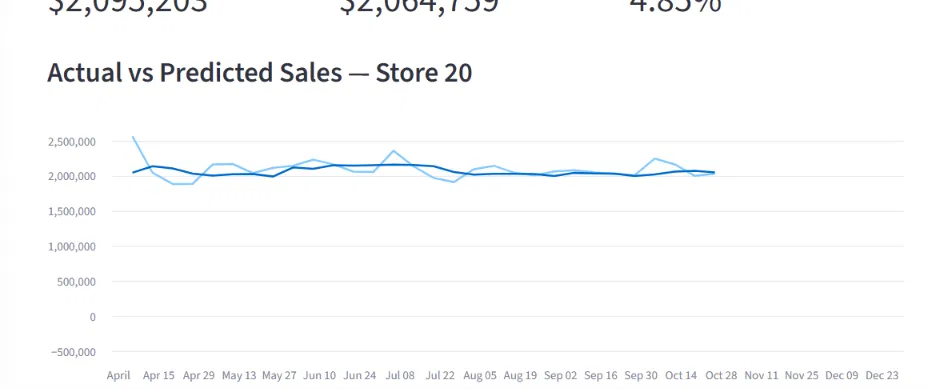
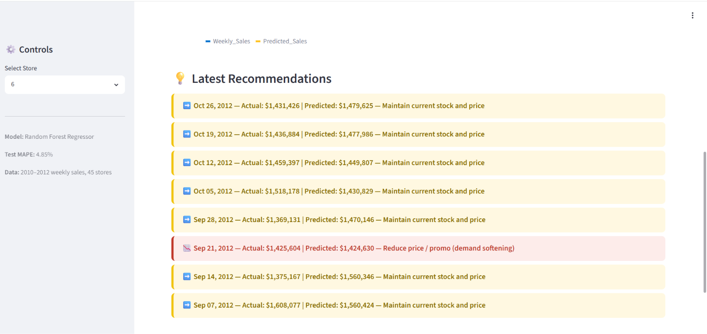

# 🛒 Walmart Sales Forecasting & Dynamic Pricing Engine

Predicting weekly retail sales and translating predictions into actionable pricing/inventory recommendations — modeled on real retail-industry hackathon themes (Walmart Sparkathon's demand-forecasting + dynamic pricing focus).

## 📌 Problem Statement
Retailers lose revenue two ways: **stockouts** (when demand is underestimated) and **excess inventory** (when it's overestimated). This project builds a forecasting model to predict next week's store sales, then layers a rule-based recommendation engine on top to suggest stock/pricing actions — going beyond a typical "predict and stop" ML notebook.

## 🧰 Tech Stack
**Languages & Libraries:** Python, Pandas, NumPy, scikit-learn, Matplotlib  
**Modeling:** Linear Regression, Random Forest, time-series feature engineering (lag/rolling features)  
**Deployment:** Streamlit (interactive dashboard), Pyngrok (live tunnel hosting)  
**Tools:** Google Colab, Kaggle API, Git/GitHub

## 📊 Dataset
- **Source**: Walmart weekly sales data, 45 stores, 2010–2012 (6,435 records)
- **Features**: Store, Date, Weekly_Sales, Holiday_Flag, Temperature, Fuel_Price, CPI, Unemployment

## 🔍 Key Insights (from EDA)

1. **Holiday weeks average only 7.8% higher sales overall** — but this hides a sharp pattern: **Thanksgiving week alone drives a ~40% sales spike**, while other flagged holidays (Super Bowl, Labor Day) show almost no lift. A single generic `Holiday_Flag` is too coarse for accurate forecasting.
2. **Store size varies enormously** — the highest-performing store averages **$2.1M/week**, the lowest just **$260K/week** (an 8x gap), making store identity a critical signal.
3. **Macroeconomic factors barely matter** — Temperature, Fuel Price, CPI, and Unemployment all show near-zero correlation with sales, indicating local demand patterns and seasonality dominate over broader economic conditions.
4. **Recent sales momentum is the strongest predictor** — lag and rolling-average features account for ~94% of the trained model's predictive power.

## 🛠️ Approach

| Stage | What was done |
|---|---|
| Data Cleaning | Converted dates, sorted chronologically per store, verified no missing/duplicate data |
| Feature Engineering | Lag features (last week's sales), 4-week rolling average, calendar features, Thanksgiving-specific flag |
| Modeling | Compared Linear Regression vs Random Forest using a **time-based train/test split** (train on 2010–early 2012, test on remaining months) |
| Evaluation | MAE, RMSE, and MAPE (Mean Absolute Percentage Error) |
| Business Layer | Rule-based recommendation engine: compares predicted sales vs recent rolling average to suggest "increase stock," "reduce price," or "maintain" |
| Deployment | Interactive Streamlit dashboard for live exploration by store |

## 📈 Model Results

| Model | MAE | RMSE | MAPE |
|---|---|---|---|
| Linear Regression | $52,482 | $77,768 | 5.54% |
| **Random Forest (final)** | **$50,803** | **$75,077** | **4.85%** |

## 🖥️ Dashboard Preview




*(Run locally to interact live — see instructions below)*

## 🚀 How to Run

```bash
pip install -r requirements.txt
streamlit run app.py
```

## 📁 Repository Structure
